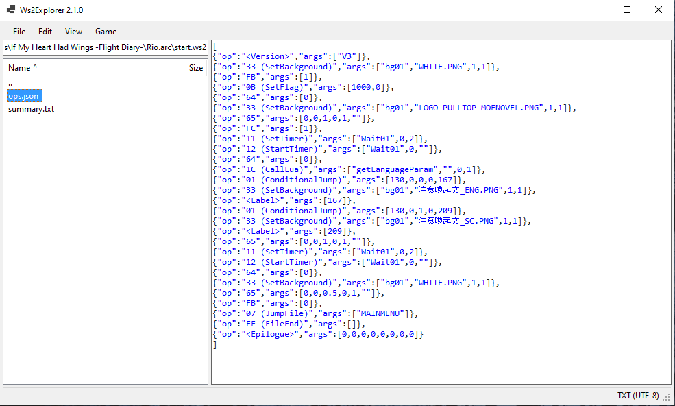
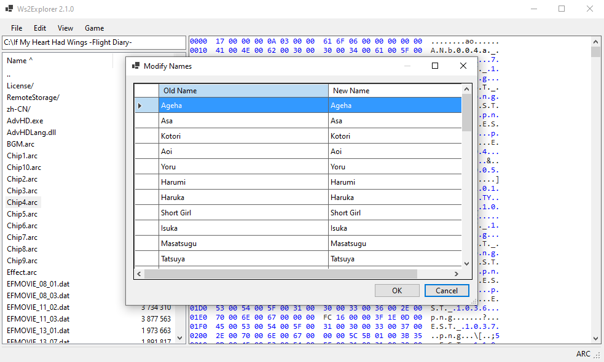
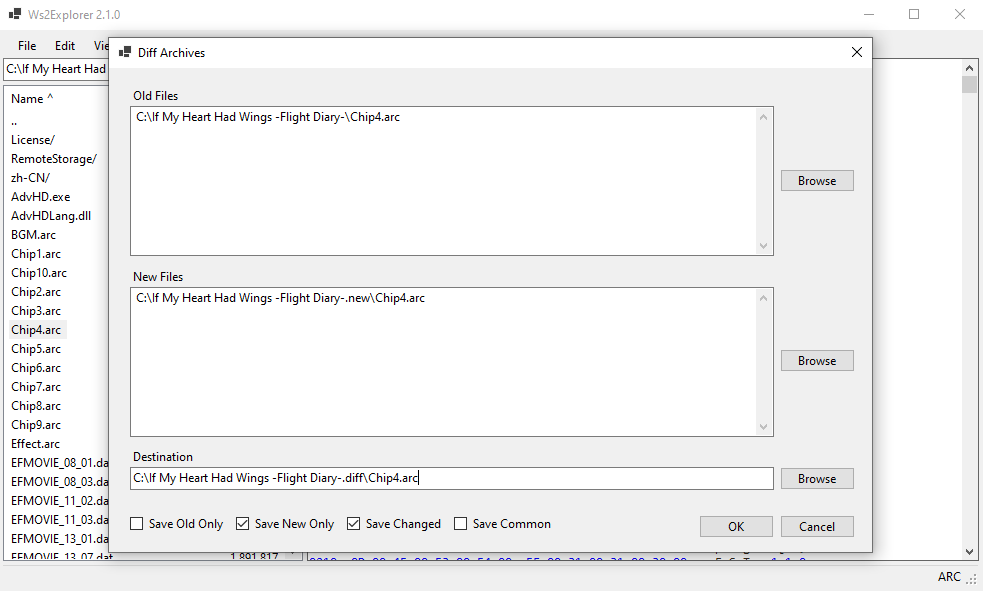
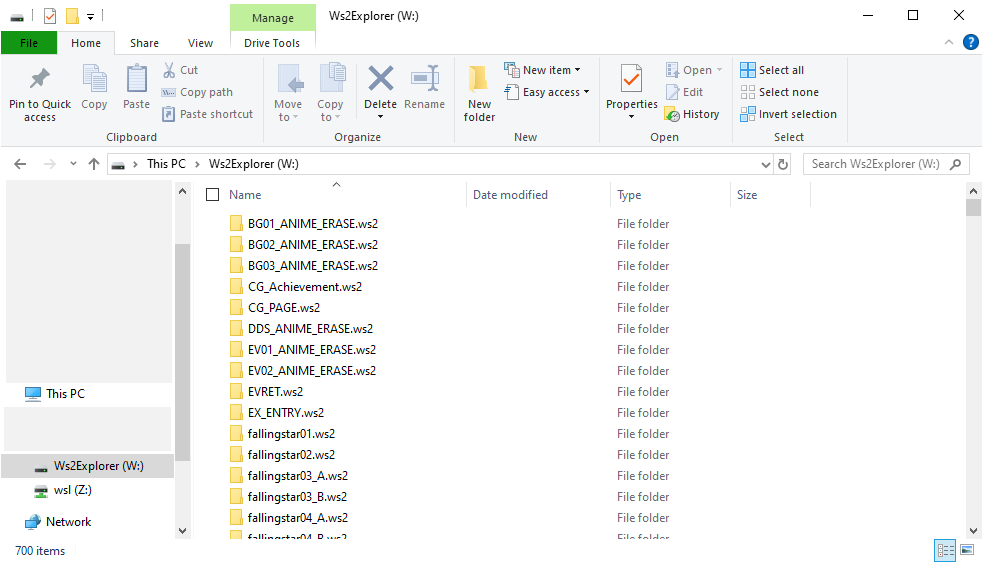
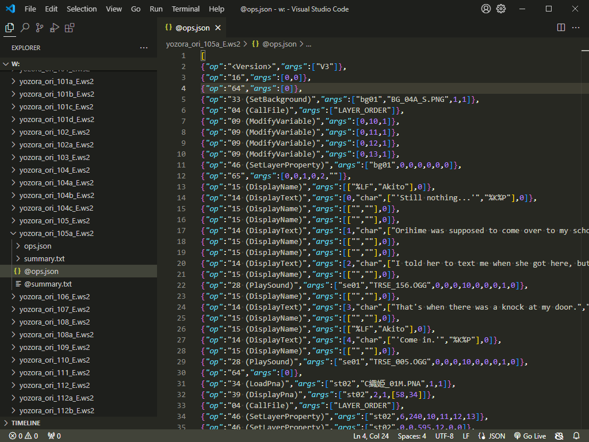

# Ws2Explorer

A comprehensive set of tools for editing games based on WillPlus' AdvHD engine.

<!-- no toc -->
- [GUI Editor](#gui-editor)
- [Dokan Virtual Filesystem](#dokan-virtual-filesystem)
- [Ws2Explorer C# Library](#ws2explorer-c-library)

## Information Base

- [Tested Games](Wiki/TestedGames.md)
- [File Formats](Wiki/FileFormats.md)
- [List of Understood Opcodes](Wiki/UnderstoodOpcodes.md)
- [Reverse Engineering Opcodes](Wiki/ReverseEngineeringOpcodes.md)
- [Ws2Explorer API Reference](Wiki/Ws2ExplorerAPI/index.md)
- [Ws2Explorer GUI User Guide](Wiki/Ws2ExplorerGuiUserGuide.md)

## GUI Editor

A powerful file manager to browse and edit archives in-place
and perform common operations to modify the game.

### Download

[Releases](https://github.com/kevlu123/VN-Patching-Tools/releases?q=Ws2Explorer)

### Recognised file types

| Name             | Description                     |
|------------------|---------------------------------|
| .arc             | Archive/Legacy archive          |
| .ws2             | Script                          |
| .wsc             | Legacy Script                   |
| .dat             | Video                           |
| .ogg             | Audio                           |
| .lua             | Compiled Lua                    |
| .lng             | Language pack                   |
| .ptf             | Compressed font                 |
| .otf             | Open type font                  |
| .ttf             | True type font                  |
| .pna, .mos       | PNG array archive               |
| .wip, .msk, .mos | Legacy image array archive      |
| .png             | PNG image                       |
| pan.dat          | Audio panning data?             |

### Features
- File management
    - Extract and create archives
    - Diff archives
    - Windows File Explorer/desktop drag and drop

- Asset editing
    - Edit text and character names
    - Edit in-place (without needing to extract and repack)
    - Word wrapping by pixel width or character count
    - Set WS2 entry point
    - Decompile/compile WS2 and WSC scripts
    - Edit images/text/hex in chosen editor
    - Add or rearrange images to PNA/WIP files
    - Convert compiled Lua to text (by converting binary to hex string, not by decompiling)
    - Shortcut to run game with Locale Emulator

- Analysis
    - Media preview for PNG, OGG, TTF/OTF, text, and hex
    - Find all string references
    - Find all choice locations
    - Generate JSON/Mermaid flowchart

### Upcoming Features

- Recursive repacking (opposite of Recursive Extract)
- Flag analysis and editing

### Screenshots





## Dokan Virtual Filesystem

(Experimental)

Mount an archive as a virtual **readonly** filesystem.

### Usage

Install [Dokan driver](https://github.com/dokan-dev/dokany/releases).

Build Ws2Explorer.Dokan.
```sh
cd Ws2Explorer.Dokan
dotnet build
```

Run the executable.
```sh
./bin/Debug/net8.0-windows/Ws2Explorer.Dokan.exe path/to/archive [path/to/mountpoint/or/default/to/W:]
```




## Ws2Explorer C# Library

[Full API Reference](Wiki/Ws2ExplorerAPI/index.md)

[Examples](Examples) (or see how [Ws2Explorer.Gui](Ws2Explorer.Gui/ApplicationState.cs) uses this library).

### Quick Start

Create a new C# project.
```sh
mkdir Demo
cd Demo
dotnet new console
```

Add the reference to the Ws2Explorer library.
```sh
dotnet add reference path/to/Ws2Explorer/Ws2Explorer.csproj
```

Add the code to `Program.cs` to print the files inside an ARC file.
```csharp
using Ws2Explorer;
using Ws2Explorer.FileTypes;
using Ws2Explorer.HighLevel;

using ArcFile arcFile = await FileTool.ReadFile("Example.arc").Decode<ArcFile>();
foreach (Ws2Explorer.FileInfo fileInfo in arcFile.ListFiles())
{
    Console.WriteLine($"{fileInfo.Filename} is {fileInfo.FileSize} bytes");
}
```

Run the program.
```sh
dotnet run
```
