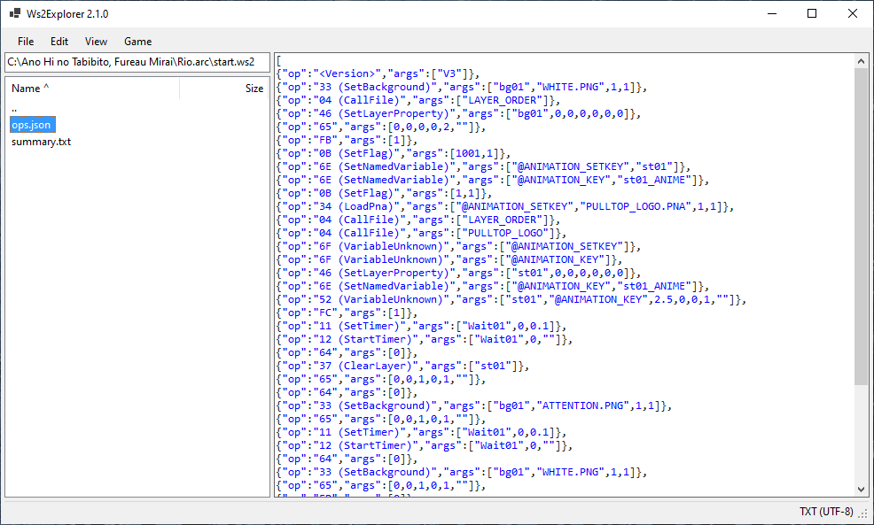
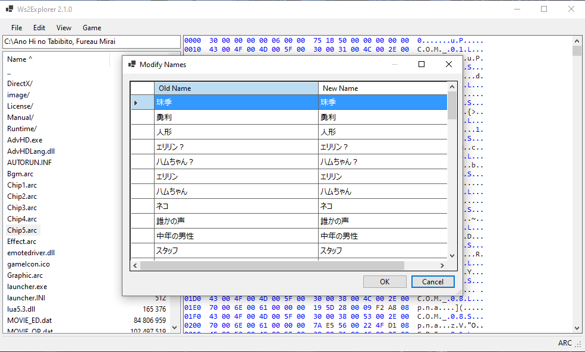
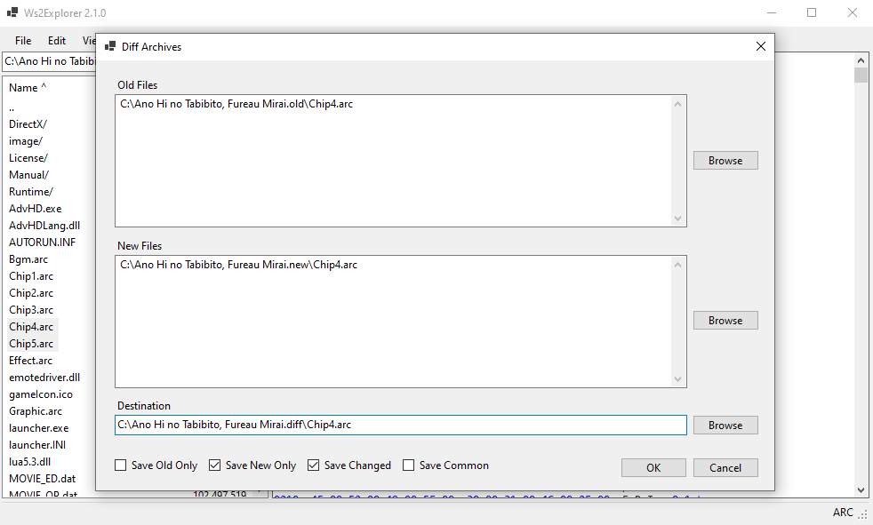
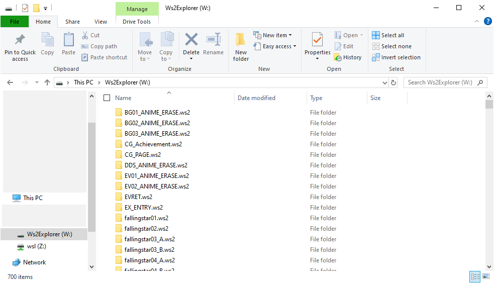
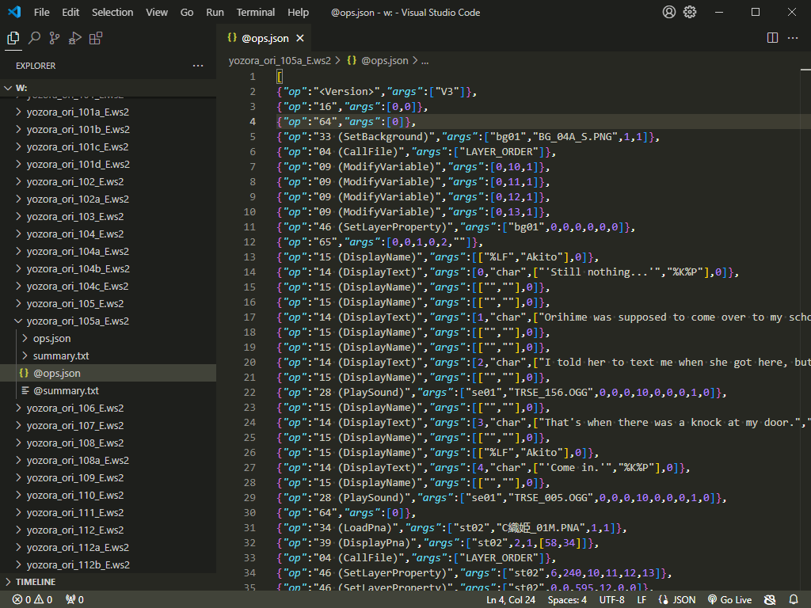

# Ws2Explorer

A comprehensive set of tools for editing games based on WillPlus' AdvHD engine.

<!-- no toc -->
- [GUI Editor](#gui-editor)
- [Dokan Virtual Filesystem](#dokan-virtual-filesystem)
- [Ws2Explorer C# Library](#ws2explorer-c-library)
- [File Formats Documentation](FileFormats.md)

I am available to help with modifying any AdvHD game. Submit an issue for any queries.

## GUI Editor

A powerful file manager to browse and edit archives in-place
and perform common operations to modify the game.

### Download

[Releases](https://github.com/kevlu123/VN-Patching-Tools/releases?q=Ws2Explorer)

### Recognised file types

| Name    | Description                                                   |
|---------|---------------------------------------------------------------|
| .arc    | Archive (legacy version used in earlier games also supported) |
| .ws2    | Script                                                        |
| .dat    | Video                                                         |
| .ogg    | Audio                                                         |
| .lua    | Compiled Lua                                                  |
| .ptf    | Compressed font                                               |
| .otf    | Open type font                                                |
| .ttf    | True type font                                                |
| .pna    | PNG array archive                                             |
| .mos    | Same as .pna but used for masks                               |
| .png    | PNG image                                                     |
| pan.dat | Audio panning data?                                           |

### Features

- Copy files to and from Windows File Explorer.
- Extract files from archives.
- Recursively extract files.
- Decompile/compile WS2 scripts.
- Create archives.
- Edit file in editor or your choice.
- Add new images to PNA files.
- Rearrange images in PNA files.
- Run game with Locale Emulator
- Set WS2 entry point.
- Edit character names.
- Convert compiled Lua to text (does not decompile).
- Generate diff archives.
- Find all string references e.g. to an asset file.
- Find all choice locations.
- Generate JSON/Mermaid flowchart.
- Media preview for PNG, OGG, TTF/OTF, text, and hex.





## Dokan Virtual Filesystem

(Experimental)

Mount an archive as a virtual **readonly** filesystem.

### Usage

Install [Dokan driver](https://github.com/dokan-dev/dokany/releases).

Build Ws2Explorer.Dokan.
```sh
cd Ws2Explorer.Dokan
dotnet build
```

Run the executable.
```sh
./bin/Debug/net8.0-windows/Ws2Explorer.Dokan.exe path/to/archive [path/to/mountpoint/or/default/to/W:]
```




## Ws2Explorer C# Library

[Full API Reference](Ws2Explorer/Docs/index.md)

[Examples](Examples) (or see how [Ws2Explorer.Gui](Ws2Explorer.Gui/ApplicationState.cs) uses this library).

### Quick Start

Create a new C# project.
```sh
mkdir Demo
cd Demo
dotnet new console
```

Add the reference to the Ws2Explorer library.
```sh
dotnet add reference path/to/Ws2Explorer/Ws2Explorer.csproj
```

Add the code to `Program.cs` to print the files inside an ARC file.
```csharp
using Ws2Explorer;
using Ws2Explorer.FileTypes;
using Ws2Explorer.HighLevel;

using ArcFile arcFile = await FileTool.ReadFile("Example.arc").Decode<ArcFile>();
foreach (Ws2Explorer.FileInfo fileInfo in arcFile.ListFiles())
{
    Console.WriteLine($"{fileInfo.Filename} is {fileInfo.FileSize} bytes");
}
```

Run the program.
```sh
dotnet run
```
