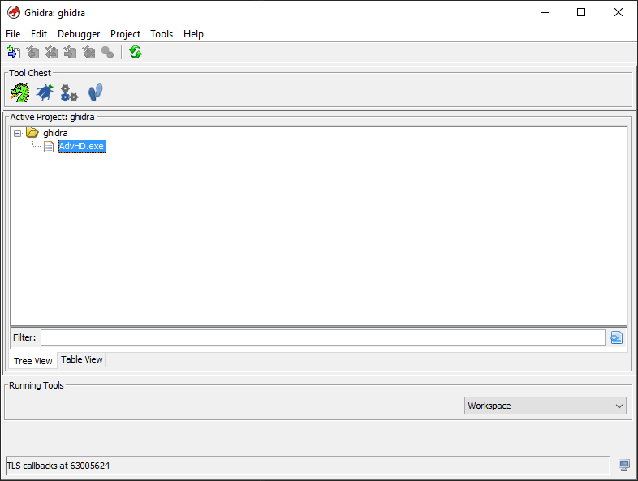
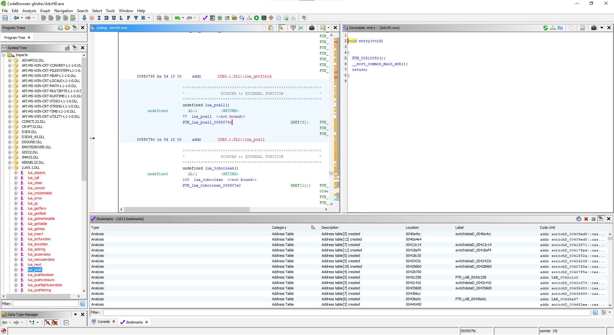
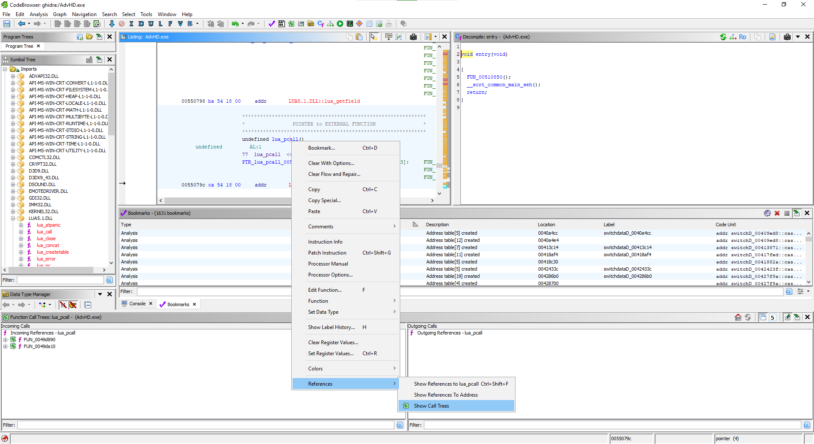
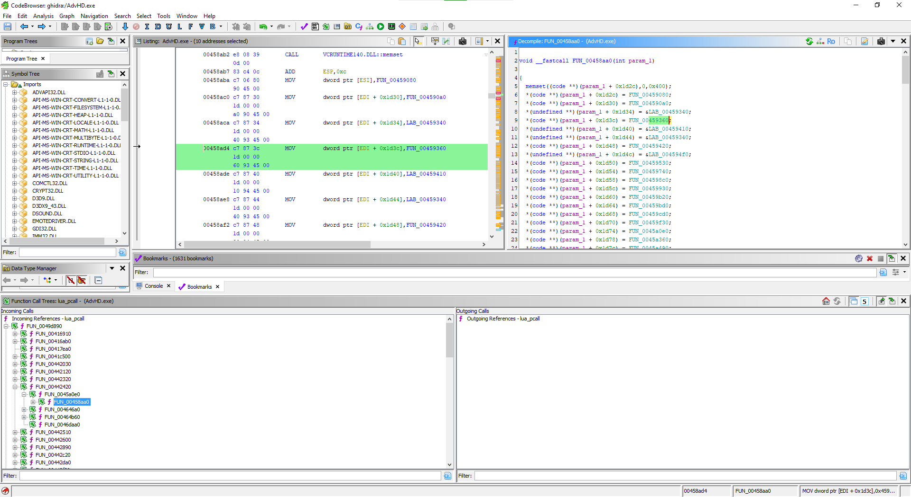
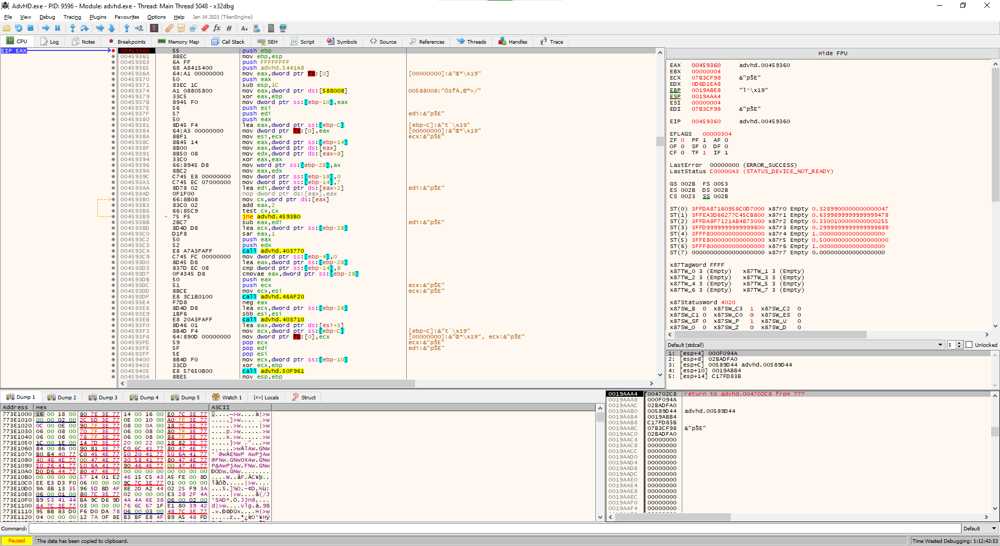

## Information Base

- [Tested Games](TestedGames.md)
- [File Formats](FileFormats.md)
- [List of Understood Opcodes](UnderstoodOpcodes.md)
- [Reverse Engineering Opcodes](ReverseEngineeringOpcodes.md)
- [Ws2Explorer API Reference](Ws2ExplorerAPI/index.md)
- [Ws2Explorer GUI User Guide](Ws2ExplorerGuiUserGuide.md)

# Reverse Engineering WS2 Opcodes

## Set Up a Ghridra Project

- Open Ghidra > File > New Project... > Non-Shared Project > Fill in project your details > Finish
- Drag your exe file into the Ghidra window, press OK, and wait for it to import. This will take some time.



- Double click the added executable in Ghidra.
- Press Yes to analyse, then press Analyse. Wait until the progress bar in the bottom right has completed. This will take some time.

## Find The Opcode Handler Functions

- In the Symbol Tree (left side bar), navigate to Imports > the Lua DLL > lua_pcall.



- Right click the `lua_pcall` function in the Listing window and select References > Show Call Trees.



- In the Function Call Trees Incoming Calls window (bottom left), find the function that initialises the opcode handler table.

  The Decompile window (top right) shows the C-like decompiling of the selected function. The function we are looking for has a long series of function pointer assignments. This should be pretty easy to find.



## Find The Opcode Handler Caller

- Take the base address of the opcode handler array (`param_1 + 0x1d2c` in my case) and add `4 * opcode` to see the handler for a specific opcode. In particular, opcode CALL_FILE_04 is one that's commonly run on start so find the runtime address of that handler (in my case, `param_1 + 0x1d2c + (4 * 4) = param_1 + 0x1d3c` which gives me a function at address `0x00459360`).

- Use a debugger to place a breakpoint at this address and find the caller of this function. This is a dynamic function call so Ghidra's code browser won't be very helpful.

  -  For x64dbg (32-bit), open the exe file and use Ctrl+G to go to the function's address.
  - Place a breakpoint at that address by pressing the red circle to the left of the disassembly.
  - Press F5 to run. The first time, it will break in the main function.
  - Press F5 again and hopefully the breakpoint is hit. If not, play the game for a bit or try a different opcode e.g. SET_FLAG_0B.
  - See the return address (`0x004702C8`) in the Stack window (bottom right).



## Find The Opcode Format Table

- Go back to Ghidra and press G to goto to this address.
- Find the opcode format table which describes the structure of every opcode. The code isn't the same for every game but the opcode format table is always referenced very close by. Here is an example which reads in order from (1) to (5):

```c
// (Info) This is an instruction pointer bounds check (ip < end - start).
if (uVar3 < (uint)(*(int *)(iVar2 + 0x18) - *(int *)(iVar2 + 0x14))) {
  // (4.1) This is where the opcode is assigned.
  // The argument parsing must be after this point since the opcode
  // needs to be known before the arguments can be parsed.
  // The strategy is to look inside every function between (4.1) and (1)
  // for the opcode format table.
  bVar6 = *(byte *)(uVar3 + *(int *)(iVar2 + 0x14));
  *(uint *)(iVar2 + 0x10) = uVar3 + 1;
}
else {
  // (4.2) This is just an error case. Ignore.
  bVar6 = 0;
}
local_78 = CONCAT31(local_78._1_3_,bVar6);
if ((param_4 == 0) && (iVar2 = FUN_0046fde0(this,bVar6), iVar2 != 0)) {
  piVar4 = (int *)(*(int *)((int)this + 0x30) + 0x10);
  *piVar4 = *piVar4 + -1;
  goto LAB_0047042e;
}
// (5) This function parses the opcode arguments!
FUN_004cc800(&local_38,(int *)(*(int *)((int)this + 0x30) + 0x10),bVar6);
// (3) Find where the opcode bVar6 is assigned.
uVar3 = (uint)bVar6;
local_8._0_1_ = 4;
// (2) The opcode handler is assigned here. Find where the opcode uVar3 is assigned.
pcVar1 = *(code **)((int)this + uVar3 * 4 + 0x1d2c);
if (pcVar1 == (code *)0x0) {
  FUN_0041c9c0(&local_124);
  local_8._0_1_ = 5;
  puVar7 = (undefined4 *)(*(int *)((int)this + 0x30) + 0x20);
  if (7 < *(uint *)(*(int *)((int)this + 0x30) + 0x34)) {
    puVar7 = (undefined4 *)*puVar7;
  }
  uVar8 = uVar3;
  piVar4 = FUN_00423470(&local_124,(short *)&DAT_00567768);
  piVar4 = FUN_0041ca90(piVar4,uVar8);
  piVar4 = FUN_00423470(piVar4,(short *)&DAT_005675d8);
  piVar4 = FUN_00423470(piVar4,(short *)puVar7);
  FUN_00423470(piVar4,(short *)&DAT_005675c4);
  FUN_0041d480(local_120,local_2c);
  local_8._0_1_ = 6;
  pppppuVar5 = local_2c;
  if (7 < local_18) {
    pppppuVar5 = local_2c[0];
  }
  FUN_004df390(this,1,uVar3,extraout_ECX_00,(short *)pppppuVar5);
  FUN_00403710(local_2c);
  local_8._0_1_ = 4;
  FUN_0041af10(&local_124);
}
else {
  // (1) This is address 0x004702C8 - the opcode handler call. Find where the opcode handler pcVar1 is assigned.
  iVar2 = (*pcVar1)(local_88,local_84,local_80,&local_38);
  if (iVar2 != 0) goto LAB_00470421;
}
```

```c
// This is the argument parsing function.
VARIANTARG ** FUN_004cc800(VARIANTARG **param_1,int *param_2,byte param_3)

{
  char cVar1;
  char *pcVar2;
  byte bVar3;
  int iVar4;
  int in_ECX;
  VARIANTARG *pVVar5;
  uint uVar6;
  int iVar7;
  uint uVar8;
  int **unaff_FS_OFFSET;
  undefined4 in_stack_00000010;
  VARIANTARG *local_1c;
  VARIANTARG *local_18;
  VARIANTARG *local_14;
  int *local_10;
  undefined *puStack_c;
  undefined4 local_8;
  
  puStack_c = &LAB_0054bf48;
  local_10 = *unaff_FS_OFFSET;
  *unaff_FS_OFFSET = (int *)&local_10;
  local_1c = (VARIANTARG *)0x0;
  local_18 = (VARIANTARG *)0x0;
  local_14 = (VARIANTARG *)0x0;
  iVar7 = 0;
  local_8 = 0;
  // PTR_DAT_00555eb8 is the opcode format table!
  pcVar2 = (&PTR_DAT_00555eb8)[param_3];
  if (pcVar2 == (char *)0x0) {
    *param_1 = (VARIANTARG *)0x0;
    param_1[1] = (VARIANTARG *)0x0;
    param_1[2] = (VARIANTARG *)0x0;
  }
  else {
    pVVar5 = (VARIANTARG *)0x0;
    if (-1 < *pcVar2) {
LAB_004cc876:
      cVar1 = pcVar2[iVar7];
      iVar4 = *(int *)(in_ECX + 0x14) + *param_2;
      if (cVar1 != '\a') goto code_r0x004cc883;
      iVar4 = FUN_004ccc40(&local_1c,iVar4,in_stack_00000010,0,0);
      *param_2 = *param_2 + iVar4;
      bVar3 = FUN_00458130(local_18 + -1);
      uVar8 = (uint)pcVar2[iVar7 + 1];
      uVar6 = (uint)bVar3;
      if (bVar3 != 0) {
        // Look for a loop and comparison with 0xb.
        //
        // This loop iterates over the arguments and 0xb
        // is a bounds check for the argument type.
        // Together, this is pretty conclusive that the
        // opcode format table can be found near the top
        // of this function.
        //
        // The table is stored in global static memory so Ghidra
        // will show it as PTR_DAT_XXXXXXXX.
        do {
          if (uVar8 < 0xb) {
            iVar7 = FUN_004ccc40(&local_1c,*(int *)(in_ECX + 0x14) + *param_2,in_stack_00000010,0,
                                 uVar8);
          }
          else {
            iVar7 = 0;
          }
          *param_2 = *param_2 + iVar7;
          if ((uVar8 == 6) || (uVar8 == 9)) {
            *param_2 = *param_2 + 1;
          }
          uVar6 = uVar6 - 1;
        } while (uVar6 != 0);
      }
```

The format of the opcode table is a jagged 2D array of argument types:
```c
enum type_t : uint8_t
{
  // 8 bit integer
  int8 = 0x00,
  // 16 bit integer
  int16 = 0x01,
  // 32 bit integer
  int32 = 0x04,
  // 32 bit float
  float32 = 0x05,
  // Null-terminated SJIS string (variant 1)
  string1 = 0x06,
  // 8 bit integer that indicates the length of an array.
  // The type of the array is specified directly after.
  array = 0x07,
  // This always appears after string1, string2, and string3,
  // except for string arrays. It seems unused.
  string_end = 0x08,
  // Null-terminated SJIS string (variant 2)
  string2 = 0x09,
  // Null-terminated SJIS string (variant 3)
  string3 = 0x0A,
  // End of arguments
  end = 0xFF,
};

type_t* opcode_format_table[255];
```

Example:

```
   +---+
   |   |      +----+
00 | X | ---> | FF |                          ()
   |   |      +----+
   +---+
   |   |      +----+----+----+----+----+----+
01 | X | ---> | 00 | 01 | 05 | 04 | 04 | FF | (int8, int16, float32, int32, int32)
   |   |      +----+----+----+----+----+----+
   +---+
   |   |      +----+----+
02 | X | ---> | 04 | FF |                     (int32)
   |   |      +----+----+
   +---+
   |   |
03 | 0 |                                      opcode doesn't exist
   |   |
   +---+
   |   |      +----+----+----+
04 | X | ---> | 0A | 08 | FF |                (string)
   |   |      +----+----+----+
   +---+
   |   |

    ...

   |   |
   +---+
   |   |      +----+----+
0F | X | ---> | 00 | FF |                     (int8)
   |   |      +----+----+
   +---+
   |   |

    ...

   |   |
   +---+
   |   |      +----+----+----+
3F | X | ---> | 07 | 06 | FF |                (string array)
   |   |      +----+----+----+
   +---+
   |   |

    ...

   |   |
   +---+
   |   |
FF | 0 |                                      opcode doesn't exist
   |   |
   +---+
```

The main 255 length array can be easily extracted with Ghidra or a hex editor.
but the subarrays are trickier since there are a lot of them and the subarrays 
are not necessarily placed contiguously.

A method is to take the pointer `opcode_format_table[1]` and compare it with the exe file offset where the subarray is (call it `subarray_1_exe_offset`). The subarray of opcode n can then be found in the exe file at offset
```c
opcode_format_table[n] - opcode_format_table[1] + subarray_1_exe_offset
```

Note that SHOW_CHOICE_0F is special since the arguments themselves can be other
opcodes and their arguments. The opcode format table says that it only has a
single int8 argument. This argument corresponds to the number of choices to
show. The choice arguments themselves are not listed in this table.

FILE_END_FF is also technically not an opcode. The table shows it as null
but we can treat it as an opcode with 8 bytes of arguments.
