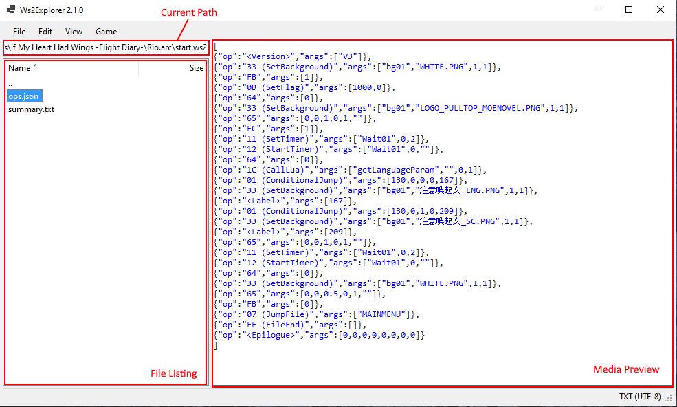

## Information Base

- [Tested Games](TestedGames.md)
- [File Formats](FileFormats.md)
- [List of Understood Opcodes](UnderstoodOpcodes.md)
- [Reverse Engineering Opcodes](ReverseEngineeringOpcodes.md)
- [Ws2Explorer API Reference](Ws2ExplorerAPI/index.md)
- [Ws2Explorer GUI User Guide](Ws2ExplorerGuiUserGuide.md)

# Ws2Explorer GUI User Guide

- [Ws2Explorer GUI User Guide](#ws2explorer-gui-user-guide)
  - [Interface](#interface)
    - [Current Path](#current-path)
    - [File Listing](#file-listing)
      - [Useful Navigation](#useful-navigation)
    - [Media Preview](#media-preview)
  - [Menu \> File](#menu--file)
    - [New](#new)
    - [New Directory](#new-directory)
    - [Open](#open)
    - [Open Directory](#open-directory)
    - [Export](#export)
    - [Recursive Extract](#recursive-extract)
    - [Diff](#diff)
    - [Create Archive](#create-archive)
      - [Create ARC](#create-arc)
      - [Create ARC (Legacy, 8 char)](#create-arc-legacy-8-char)
      - [Create ARC (Legacy, 12 char)](#create-arc-legacy-12-char)
      - [Create LNG](#create-lng)
      - [Create PAN](#create-pan)
      - [Create PNA/WIP](#create-pnawip)
      - [Create PTF](#create-ptf)
      - [Create WS2/WSC](#create-ws2wsc)
    - [Open Archive](#open-archive)
    - [Reveal in File Explorer](#reveal-in-file-explorer)
    - [Set Editors](#set-editors)
    - [About](#about)
    - [Exit](#exit)
  - [Menu \> Edit](#menu--edit)
    - [Edit in Application](#edit-in-application)
    - [Edit As](#edit-as)
    - [Edit WS2/WSC Text](#edit-ws2wsc-text)
    - [Rename](#rename)
    - [Delete](#delete)
    - [Duplicate](#duplicate)
    - [Copy](#copy)
    - [Paste](#paste)
    - [Change Path](#change-path)
    - [PNA/WIP](#pnawip)
      - [Add Entry](#add-entry)
      - [Swap Entries](#swap-entries)
  - [Menu \> View](#menu--view)
    - [Refresh](#refresh)
    - [Go to Parent](#go-to-parent)
    - [Go Back](#go-back)
    - [Go Forward](#go-forward)
    - [Sort By](#sort-by)
    - [Word Wrap](#word-wrap)
    - [List Files](#list-files)
    - [Show Metadata](#show-metadata)
    - [PNA](#pna)
      - [Show Empty](#show-empty)
  - [Menu \> Game](#menu--game)
    - [Launch Game](#launch-game)
    - [Set WS2 Entry Point](#set-ws2-entry-point)
    - [Edit Names](#edit-names)
    - [Wrap Text](#wrap-text)
    - [Convert Luac to Text](#convert-luac-to-text)
    - [Find String References](#find-string-references)
    - [Show Choices](#show-choices)
    - [Show Flowchart](#show-flowchart)

## Interface

### Current Path

Displays the path of the current open directory or archive. Paths may recursively refer inside archives.

Press Tab to autocomplete the path as you type. The path will only be autocompleted if there is a unique match.

### File Listing

Displays the files and their byte sizes inside the current open directory or archive.

One or more files can be selected at a time to operate on.

`..` refers to the parent directory.

The sorting can be changed by clicking the headers or with `View > Sort By`.

Files can be dragged and dropped to and from Windows File Explorer, different instances of Ws2Explorer.Gui, and other programs. 

#### Useful Navigation

- `Backspace` Go up a directory (`Del` is used for deleting files).
- `Alt+Left` Go back to previous path.
- `Alt+Right` Go forward (opposite of `Alt+Left`).

### Media Preview

Displays a preview of the selected file. Supported media types are images, audio, fonts, text, and hex.

## Menu > File

### New

Create a new empty file in the current open directory or archive.

### New Directory

Create a new directory in the current open directory. Directories cannot be created inside archives.

### Open

Open an archive and set that as the current open archive.

### Open Directory

Open a directory set that as the current open directory.

### Export

Extract and save the selected file(s) to a location on disk.

### Recursive Extract

Recursively extract the selected file(s). An option is given to filter which files to extract by matching against a regex. To extract all, use the default regex `.*`.

### Diff

Compare the files inside two sets of directories or archives, and save the difference in an a new `.arc` archive. Typically, this function is used to find differences between two `.arc` files (specifying one file in each set).

Specify the first set in `Old Files`, and the second set in `New Files`, and specify type of archive to output the difference in and its destination path.

Files inside the set of directories and archives are compared and partitioned into four sets:
- Old-only: Files present only in the `Old Files` set.
- New-only: Files present only in the `New Files` set.
- Common and different: Files present in both `Old Files` and `New Files` but which have different data in each set.
- Common and identical: Files present in both `Old Files` and `New Files` and are identical in both sets.

Use the checkboxes to select which of the four partitions are saved to the output archive. Checking `Common and different` will save the `New Files` version.

Behaviour is not defined for files which appear multiple times in the same set.

### Create Archive

Create an archive of the specified type from the selected file(s).

#### Create ARC

Create a `.arc` archive from the selected file(s).

#### Create ARC (Legacy, 8 char)

Create a legacy `.arc` archive from the selected file(s).

File extensions must be exactly 3 characters long and the filename without the dot and extension must be 8 characters or less.

#### Create ARC (Legacy, 12 char)

Create a legacy `.arc` archive from the selected file(s).

File extensions must be exactly 3 characters long and the filename without the dot and extension must be 12 characters or less.

#### Create LNG

Create a language pack file from a JSON file containing the strings. View an LNG file for an example of the JSON format.

A game specific XOR key (value between 0 and 255) is required to construct the archive.

#### Create PAN

Create a PAN file from a single JSON file (with any name). View a PAN file for an example of the JSON format.

#### Create PNA/WIP

Create an image archive from a set of PNG files and JSON files containing metadata for the images.

Image filenames must be in the format `img<N>.png` and image metadata filenames must be in the format `meta<N>.json` where `<N>` is a number representing the 0-based index of the image. Additionally, there must be a JSON file called `header.json` containing toplevel metadata for the archive. View a PNA/WIP file for an example of the JSON format.

#### Create PTF

Create a compressed font file from a OTF or TTF file.

A game specific XOR key (value between 0 and 255) is required to construct the archive.

#### Create WS2/WSC

Create a script file from a JSON file called `ops.json` containing the instructions, an optionally another JSON file called `new_text.json` which overrides the text in `ops.json`.

View a WS2/WSC script file for an example of the JSON format.

### Open Archive

Open the selected file as a specific archive type. This is useful when a file is automatically detected as the wrong type due to there being multiple possibilities.

### Reveal in File Explorer

Open Windows File Explorer at the selected file. Files inside archives will not work.

### Set Editors

Set the program and program arguments to use for editing media. Supported media types are text, images, and hex.

An example of using Notepad++ as the text editor is
- Program: `C:\Program Files\Notepad++\notepad++.exe`
- Arguments: `-multiInst -nosession`

### About

Show information about this program.

### Exit

Close Ws2Explorer.Gui.

## Menu > Edit

### Edit in Application

Edit the selected file in the editor configured for the detected media type.

This extracts the file to be edited to a temp folder and launches the configured program for editing. Once the editor process has been closed, if there have been changes, the edited file is repacked into the archive. This works for nested archives.

### Edit As

Edit the selected file, manually specifying the media type.

### Edit WS2/WSC Text

Edit the text of a WS2 or WSC script file. The WS2/WSC script file must be selected or be opened as the current archive.

Internally, this works similar to `Edit in Application`. The `text.json` inside the script file is located and extracted to be edited as text. However, the edited file is repacked under the filename `new_text.json` rather than its original name `text.json`. This is due to the special way script files are created.

### Rename

Rename the select file or directory.

### Delete

Delete the selected file(s) and directories.

### Duplicate

Duplicate the selected file and save the new file with a `.bak` extension.

If this file already exists, an option is given to choose whether to overwrite, cancel, or rename to another available name.

### Copy

Copy the selected file(s) and directories to the clipboard.

This copies the paths as a _file drop list_ which also allows pasting in Windows File Explorer and other programs if the paths do not refer inside an archive. This does not copy the paths as text.

### Paste

Paste the files in the clipboard to the current open directory or archive.

This can be a file copied from Windows File Explorer, Ws2Explorer.Gui, or other programs.

### Change Path

Focuses the Current Path textbox.

### PNA/WIP

Editing options for PNA/WIP image archives.

#### Add Entry

Add a new empty entry to the current open PNA/WIP archive.

#### Swap Entries

Swap two selected entries in a PNA/WIP archive, effectively swapping their indices.

This is useful for rearranging the order of images.

## Menu > View

### Refresh

Refresh the file listing from disk.

The filesystem is not watched for changes so it is necessary to manually refresh to see changes that occurred outside of Ws2Explorer.Gui.

### Go to Parent

Go up a directory.

### Go Back

Go back to the previous path.

### Go Forward

Undo Go Back.

### Sort By

Sort the file listing by filename, file type (extension), or size.

### Word Wrap

Toggle word wrap in the media preview.

### List Files

Show a copy-friendly view of the file listing.

### Show Metadata

Show the metadata for the selected file in the detected format.

### PNA

View options for PNA archives.

#### Show Empty

Show empty entries in the file listing.

## Menu > Game

Options for editing/anaylsing games as a whole rather than individual files.

All options here can be run from any folder with any level of nesting under the game directory.

### Launch Game

Launch the game under Locale Emulator.

The game executable is searched in the current open and parent directories. The executable is determined by searching for a directory with at least one `.arc` file and `advhd.exe`.

### Set WS2 Entry Point

Set the WS2 script to start the game at.

The game is hardcoded to run `start.ws2` first so this option sets the script which `start.ws2` will jump to. Normally, an unmodified game will jump to `mainmenu.ws2`.

This is useful for skipping the mainmenu and starting at an arbitrary script for faster testing.

### Edit Names

Scan for a list of character names and show a dialog for editing them.

Change the name in the `New Name` column and press OK to update all usages of the name.

### Wrap Text

Wrap all text in the script files.

It is highly recommended to create a backup of all scripts before applying this option.

After applying the text wrapping, any lines exceeding the number of lines specified in `Warn when line count exceeds` are displayed. Exceeding the line count does NOT abort the text wrapping!

Text can be wrapped by pixel or character length. Character length can be used for monospaced fonts and for quick testing, otherwise wrapping by pixels provides proper accuracy. For wrapping by pixels, the font and font size must be specified.

To assist in deciding the pixel length threshold, there is a Pixel Measurement Tool which opens a translucent always-on-top resizable window which displays its size. 

### Convert Luac to Text

Convert the compiled Lua files in `script.arc` to text form by encoding the binary as a hex string and adding a stub to decode and load the Lua chunk.

This is useful for allowing more Lua to be added before or after the original Lua code.

### Find String References

Find the location and number of occurrences of a string.

The search can be made to be case sensitive, or require a full string match rather than a substring match.

All string type arguments of the instructions in the script files are searched.

### Show Choices

Show for all choices in the game.

The location of each choice option and their jump targets are displayed. The jump target may be a byte offset into the same script file, or more commonly the start of another script file.

### Show Flowchart

Generate a flowchart describing the flow of the script files.

By default, some nodes of the graph are hidden to remove noise. Nodes `start`, `replay_exe`, `evret`, and any leaf nodes are hidden. Leaf nodes are usually unreachable and are left over from internal development. These nodes can be unhidden with the option `Show all arcs`.

Two formats are supported:

- Mermaid: A graph in Mermaid format which can be visualised with <https://mermaid.live>
- JSON: An adjacency list in JSON format.
